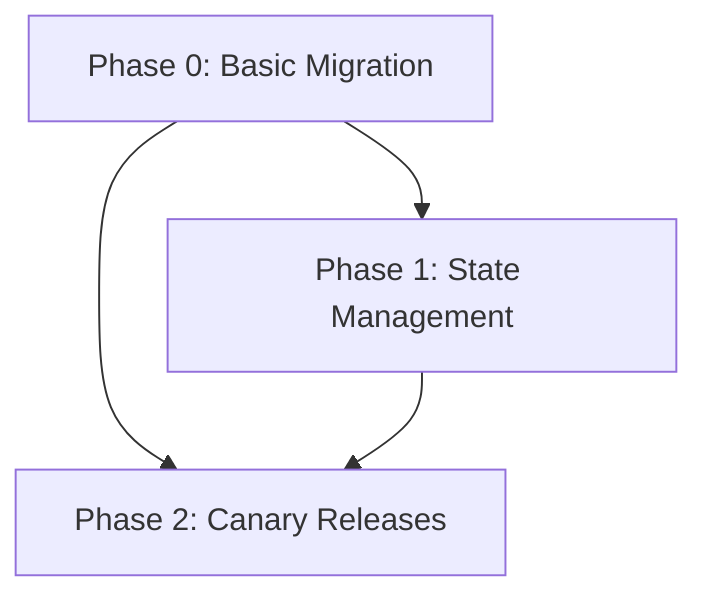

# Phase 4: Content Planning Commands

## Objective

Turn research output into planned work items (phases). This is where idea decomposition happens — a single research effort can produce multiple tutorials, deep-dives, experiments, or explainers.

## Architecture Note

Content planning bridges research and post creation:

- **`draft`** — Brainstorm what content pieces could come from research
- **`plan`** — Decompose brainstorm into numbered `phase/` files
- **`review`** — Evaluate brainstorm or phase files (auto-detects type)
- **`refine`** — Update artifacts based on review feedback

```text
content/
├── draft.md    → Research report → content-brainstorm.md
├── plan.md     → Brainstorm → numbered phase/ files
├── refine.md   → Update any content artifact
└── review.md   → Evaluate brainstorm or phases
```

---

## Command Summary

| Command | Purpose | Output | Self-review |
|---------|---------|--------|-------------|
| `/blog/content/draft` | Research report → content brainstorm | `content-brainstorm.md` | Yes - feasibility check |
| `/blog/content/plan` | Brainstorm → phase files | `phase/0-<slug>.md`, etc. | Yes - dependency check |
| `/blog/content/refine` | Update content artifacts | Updated artifact | Yes - re-checks review items |
| `/blog/content/review` | Evaluate brainstorm or phases | Checklist evaluation | N/A - is the review |

---

## Deliverables

### 1. Content Planning Commands

Create under `context/plugins/blog-workflow/commands/content/`:

#### draft.md

```yaml
---
name: blog/content/draft
description: Create content brainstorm from research report
arguments:
  - name: path
    description: Path to the research report
    required: true
  - name: force
    description: Overwrite existing content-brainstorm.md
    required: false
---
```

#### plan.md

```yaml
---
name: blog/content/plan
description: Decompose content brainstorm into numbered phase files
arguments:
  - name: path
    description: Path to the content brainstorm
    required: true
  - name: dry-run
    description: Preview decomposition without creating files
    required: false
  - name: force
    description: Overwrite existing phase files
    required: false
---
```

#### review.md

```yaml
---
name: blog/content/review
description: Evaluate content brainstorm or phase file
arguments:
  - name: path
    description: Path to the artifact to review
    required: true
  - name: approve
    description: Auto-approve if no fails (skip prompt)
    required: false
  - name: no-approve
    description: Keep in-review status even if passing
    required: false
---
```

#### refine.md

```yaml
---
name: blog/content/refine
description: Update content artifact based on review feedback
arguments:
  - name: path
    description: Path to the artifact to refine
    required: true
  - name: feedback
    description: Direct feedback text (alternative to ## Review section)
    required: false
---
```

### 2. Artifact Templates

Create under `context/plugins/blog-workflow/.templates/`:

#### content-brainstorm.md

```markdown
---
type: content-brainstorm
id: "{{UUIDv4}}"
status: draft
parent: "{{relative path to research report}}"
persona: "{{persona slug if set}}"
created: "{{ISO 8601}}"
updated: "{{ISO 8601}}"
---

# Content Brainstorm: {{title}}

## Research Summary

{{Brief summary of key findings from research report}}

## Content Opportunities

### Tutorials

| Idea | Target Audience | Complexity | Template | Priority |
|------|-----------------|------------|----------|----------|
| {{tutorial idea}} | {{audience}} | {{beginner/intermediate/advanced}} | {{template slug}} | {{high/medium/low}} |

### Deep Dives

| Idea | Focus Area | Prerequisites | Template | Priority |
|------|------------|---------------|----------|----------|
| {{deep dive idea}} | {{area}} | {{prereqs}} | {{template slug}} | {{high/medium/low}} |

### Experiments

| Idea | Hypothesis | Effort | Template | Priority |
|------|------------|--------|----------|----------|
| {{experiment idea}} | {{what to test}} | {{estimate}} | {{template slug}} | {{high/medium/low}} |

### Explainers

| Idea | Core Concept | Audience | Template | Priority |
|------|--------------|----------|----------|----------|
| {{explainer idea}} | {{concept}} | {{audience}} | {{template slug}} | {{high/medium/low}} |

## Recommended Sequence

1. {{first piece — why start here}}
2. {{second piece — builds on first}}
3. {{third piece — etc.}}

## Dependencies

{{Note any pieces that require others to be completed first}}

## Scope Considerations

### Standalone Posts

{{Which ideas can be single posts}}

### Multi-Part Series

{{Which ideas need multiple posts or spawn child projects}}

## Feasibility Notes

{{Any concerns about effort, expertise gaps, or resource needs}}
```

#### phase.md

```markdown
---
type: phase
id: "{{UUIDv4}}"
status: draft
parent: "{{relative path to content-brainstorm.md}}"
children: []
phase_number: {{0, 1, 2, ...}}
title: "{{Phase Title}}"
content_type: tutorial | deep-dive | experiment | explainer
template: "{{template slug}}"
persona: "{{persona slug}}"
estimated_effort: "{{X-Y hours}}"
prerequisites:
  - "{{prerequisite knowledge}}"
created: "{{ISO 8601}}"
updated: "{{ISO 8601}}"
---

# Phase {{N}}: {{Title}}

## Summary

{{What this phase will cover and why it matters}}

## Target Audience

{{Who this content is for, what they should already know}}

## Key Points

1. {{Main point one}}
2. {{Main point two}}
3. {{Main point three}}

## Code Examples Needed

| Example | Purpose | Complexity |
|---------|---------|------------|
| {{example description}} | {{what it demonstrates}} | {{simple/moderate/complex}} |

## Related Research

| Finding | From Report Section | How It Applies |
|---------|---------------------|----------------|
| {{finding}} | {{section ref}} | {{application}} |

## Dependencies

### Requires (blocks this phase)

- {{other phase or external dependency}}

### Enables (this phase blocks)

- {{phases that depend on this one}}

## Child Project

{{If this phase spawns a child project, note it here}}

- Child project: `content/_projects/{{child-slug}}/`
- Reason: {{why this needs its own project}}
```

### 3. Review Checklists

Create under `context/plugins/blog-workflow/.templates/review-checklists/`:

#### content-brainstorm.md

```markdown
---
type: review-checklist
name: Content Brainstorm Review
applies_to: content-brainstorm
---

## Research Coverage

- [ ] All major research themes addressed
- [ ] Key findings translated into content ideas
- [ ] No significant gaps in coverage

## Feasibility

- [ ] Content ideas are achievable with available resources
- [ ] Effort estimates are realistic
- [ ] Expertise gaps identified (if any)

## Audience Clarity

- [ ] Target audience defined for each piece
- [ ] Complexity levels appropriate for audiences
- [ ] Prerequisites clearly stated

## Prioritization

- [ ] Priorities assigned to all ideas
- [ ] Recommended sequence is logical
- [ ] Dependencies between pieces identified

## Scope

- [ ] Standalone vs. series pieces identified
- [ ] No overlapping content between ideas
- [ ] Each idea is focused (not too broad)

## Template Selection

- [ ] Appropriate template assigned to each idea
- [ ] Template matches content type
```

#### phase.md

```markdown
---
type: review-checklist
name: Phase File Review
applies_to: phase
---

## Scope

- [ ] Phase boundaries clearly defined
- [ ] Single coherent topic/theme
- [ ] Not too broad (achievable in one post)

## Prerequisites

- [ ] Required knowledge listed
- [ ] Dependencies on other phases noted
- [ ] No circular dependencies

## Feasibility

- [ ] Estimated effort realistic
- [ ] Code examples specified are doable
- [ ] Research backing is sufficient

## Structure

- [ ] Key points identified
- [ ] Code example needs clear
- [ ] Related research linked

## Traceability

- [ ] Links back to content brainstorm
- [ ] Research findings referenced
- [ ] Child project linked (if applicable)

## Template

- [ ] Template slug specified
- [ ] Template appropriate for content type
```

---

## Content Type to Template Mapping

When creating phase files, `content_type` maps to default outline templates:

| content_type | Default Template | Alternative Templates |
|--------------|------------------|----------------------|
| `tutorial` | `getting-started.outline.md` | `tutorial.outline.md`, `how-i-built.outline.md` |
| `deep-dive` | `algorithm-deep-dive.outline.md` | `architecture-decision.outline.md`, `performance.outline.md` |
| `experiment` | `experiment.outline.md` | `debug-error.outline.md` |
| `explainer` | `first-look.outline.md` | `comparison.outline.md`, `library-evaluation.outline.md` |

**Selection logic**:

1. If user specifies `template` in brainstorm table, use that
2. Otherwise, use default template for `content_type`
3. `plan.md` can prompt: "Use default template '{{default}}'? (yes / select different)"

---

## Command Behaviors

### draft.md

**Input**: Path to research report

**Output**: `content/_projects/<slug>/content-brainstorm.md`

**Tools Used**:

- `Read` — load research report and project index
- `Write` — create content brainstorm

**Logic**:

1. **Validate input**:
   - Check research report exists at `{{path}}`
   - Check report status is `complete`
   - Check content-brainstorm.md doesn't exist (unless `--force`)

2. **Persona verification**: Check for configured persona in project
   - If set, load from `context/plugins/blog-workflow/.templates/personas/<slug>.md`
   - Display dialog (see Persona Verification Dialog below)

3. **Extract content opportunities** from report:
   - Identify potential tutorials from "how-to" findings
   - Identify deep-dives from complex technical findings
   - Identify experiments from open questions
   - Identify explainers from conceptual findings

4. **Assess feasibility** for each opportunity

5. **Assign default templates** based on content type

6. **Generate content brainstorm** using `.templates/content-brainstorm.md`

7. **Create bidirectional links**:
   - Set `parent` in brainstorm to relative path to report
   - Add brainstorm to `children` in report frontmatter

8. **Update project status** → `content-planning` in `index.md`

9. **Add to Artifacts table** in `index.md`

10. **Self-review** (feasibility check):
    - Are effort estimates realistic?
    - Are there expertise gaps?
    - Is scope manageable?

**Example output**:

```text
Created content brainstorm: content/_projects/kubernetes-migration/content-brainstorm.md

Content opportunities identified:
- Tutorials: 2 (getting-started, tutorial templates)
- Deep dives: 1 (algorithm-deep-dive template)
- Experiments: 1 (experiment template)
- Explainers: 1 (first-look template)

Total pieces: 5
Recommended sequence: 5 ordered items

Self-review: passed

Next: Run `/blog/content/plan content/_projects/kubernetes-migration/content-brainstorm.md`
      Or: Run `/blog/content/review content/_projects/kubernetes-migration/content-brainstorm.md` first
```

### plan.md

**Input**: Path to content brainstorm

**Output**: Numbered `phase/` files

**Tools Used**:

- `Read` — load content brainstorm
- `Write` — create phase files
- `Bash` — create directories

**Logic**:

1. **Validate input**:
   - Check content brainstorm exists at `{{path}}`
   - Check brainstorm status (can be `draft` or `approved`)
   - Check phase/ directory doesn't have files (unless `--force`)

2. **Dry-run mode** (if `--dry-run`):
   - Show planned phase files without creating
   - Show child project candidates
   - Exit without changes

3. **Create `phase/` directory** if needed

4. **For each content piece** in recommended sequence:
   - Generate slug from title (lowercase, hyphenated, max 50 chars)
   - Create phase file: `phase/{{N}}-{{slug}}.md`
   - Set `phase_number` in frontmatter
   - Set `parent` to relative path to content-brainstorm.md
   - Set `template` from brainstorm or default mapping
   - Populate from brainstorm data

5. **Identify child projects** (prompt user for each):
   - If phase scope is too large (multiple posts needed)
   - If phase topic diverges significantly from parent
   - Prompt: "Phase '{{title}}' may need its own project. Create child? (yes/no)"
   - If yes: create child project at `content/_projects/<child-slug>/`
   - Link via `children` in phase frontmatter
   - Link via `parent` in child `index.md`

6. **Update content brainstorm**:
   - Add all phase paths to `children` array

7. **Update parent project `index.md`**:
   - Add to Phases table
   - Add to Related Projects table (if children created)

8. **Self-review** (dependency check):
   - Are dependencies between phases explicit?
   - Is ordering logical for readers?
   - Do early phases avoid assuming later knowledge?
   - Any circular dependencies?

**Child project criteria** (inform prompts):

| Criterion | Suggests Child Project |
|-----------|------------------------|
| Estimated effort > 8 hours | Yes |
| Multiple posts needed | Yes |
| Different target audience | Yes |
| Standalone value | Yes |
| Tightly coupled to parent | No - keep as phase |

**Example output**:

```text
Decomposed into phases: content/_projects/kubernetes-migration/phase/

Phases created:
- phase/0-tutorial-basic-migration.md (tutorial, getting-started, ~4h)
- phase/1-deep-dive-state-management.md (deep-dive, algorithm-deep-dive, ~6h)
- phase/2-experiment-canary-releases.md (experiment, experiment, ~3h)

Child projects created:
- content/_projects/tutorial-ebpf/ (from phase/0, spawned due to scope)

Updated index.md:
- Added 3 phases to Phases table
- Added 1 child to Related Projects table

Self-review: passed

Next: Run `/blog/content/review content/_projects/kubernetes-migration/phase/` to validate all
```

### review.md

**Input**: Path to content brainstorm OR phase file OR phase directory

**Output**: Checklist evaluation with `## Review` section appended

**Tools Used**:

- `Read` — load artifact(s) and checklist
- `Edit` — append review section
- `Glob` — find phase files if directory provided

**Logic**:

1. **Detect input type**:
   - If path ends with `/` or is directory → batch review all phase files
   - If file → single artifact review

2. **For each artifact**:
   a. Load artifact at `{{path}}`
   b. Detect artifact type from frontmatter (`content-brainstorm` or `phase`)
   c. Load appropriate checklist:
   - `content-brainstorm` → `.templates/review-checklists/content-brainstorm.md`
   - `phase` → `.templates/review-checklists/phase.md`
   d. Evaluate each criterion (pass/warn/fail)
   e. Remove existing `## Review` section if present
   f. Append new `## Review` section to artifact

3. **Review section format**:

   ```markdown
   ## Review

   **Reviewed**: {{ISO 8601 timestamp}}
   **Result**: {{pass|warn|fail}}

   ### Research Coverage (for brainstorm) / Scope (for phase)

   - [x] Criterion — pass
   - [~] Criterion — warn: {{reason}}
   - [ ] Criterion — fail: {{reason}}

   ...

   **Summary**: {{pass_count}} pass, {{warn_count}} warn, {{fail_count}} fail

   {{If warnings or fails}}

   ### Action Items

   1. {{specific action to address issue}}
   2. {{specific action to address issue}}

   {{/If}}
   ```

4. **Determine approval**:

   | Condition | `--approve` flag | `--no-approve` flag | Default |
   |-----------|------------------|---------------------|---------|
   | All pass | approved | in-review | Prompt user |
   | Warns only | approved | in-review | Prompt user |
   | Any fail | in-review | in-review | in-review |

5. **Update status** in frontmatter

6. **Update `index.md`** with status change

**Batch review output** (for phase directory):

```text
## Content Planning Review: kubernetes-migration

Reviewed 3 phase files:

| Phase | Result | Pass | Warn | Fail |
|-------|--------|------|------|------|
| 0-tutorial-basic-migration | pass | 12 | 0 | 0 |
| 1-deep-dive-state-management | warn | 10 | 2 | 0 |
| 2-experiment-canary-releases | pass | 12 | 0 | 0 |

Overall: 2 pass, 1 warn, 0 fail

Warnings in phase/1-deep-dive-state-management.md:
- Estimated effort may be low for scope
- Missing prerequisite link to phase 0

Next: Run `/blog/content/refine` on phases with warnings
```

### refine.md

**Input**: Path to content artifact (brainstorm or phase)

**Output**: Updated artifact with `## Review` section removed

**Tools Used**:

- `Read` — load artifact and review
- `Edit` — apply changes

**Logic**:

1. **Load artifact** at `{{path}}`

2. **Detect artifact type** from frontmatter

3. **Load feedback**:
   - If `--feedback` provided, use that
   - Otherwise, read `## Review` section from artifact
   - If neither, error: "No feedback found. Provide --feedback or run review first."

4. **Load corresponding checklist** for reference

5. **Apply improvements**:

   **For content-brainstorm**:
   - Add missing content opportunities
   - Adjust priorities based on feedback
   - Clarify audience definitions
   - Fix effort estimates
   - Resolve scope issues
   - Update template assignments

   **For phase**:
   - Clarify scope boundaries
   - Add missing prerequisites
   - Fix dependency issues
   - Update code example specifications
   - Link additional research
   - Fix template selection

6. **Remove `## Review` section** (will be regenerated on next review)

7. **Reset status** → `draft`

8. **Update `updated` timestamp**

9. **Self-review** (fail items only)

10. **Update `index.md`** with status change

**Example output**:

```text
Refined: content/_projects/kubernetes-migration/phase/1-deep-dive-state-management.md

Changes applied:
- Updated effort estimate (6h → 8h)
- Added prerequisite: "Complete phase 0 first"
- Added dependency link to phase 0

Status reset to: draft

Next: Run `/blog/content/review content/_projects/kubernetes-migration/phase/1-deep-dive-state-management.md`
```

---

## Index.md Table Formats

### Phases Table (added by plan.md)

```markdown
## Phases

| # | Title | Type | Template | Status | Effort |
|---|-------|------|----------|--------|--------|
| 0 | [Basic Migration](./phase/0-basic-migration.md) | tutorial | getting-started | draft | 4h |
| 1 | [State Management](./phase/1-state-management.md) | deep-dive | algorithm-deep-dive | draft | 6h |
| 2 | [Canary Releases](./phase/2-canary-releases.md) | experiment | experiment | draft | 3h |
```

### Related Projects Table (added for child projects)

```markdown
## Related Projects

| Project | Relationship | From | Status |
|---------|--------------|------|--------|
| [eBPF Tutorial](../tutorial-ebpf/) | child | phase/0-basic-migration.md | ideation |
| [K8s Networking](../k8s-networking/) | child | phase/1-state-management.md | ideation |
```

---

## Persona Verification Dialog

When persona verification fires at `draft` start:

1. **Display current persona**:

   ```text
   This project uses persona: **Practitioner**
   (Senior engineer sharing field experience with pragmatic, battle-tested advice)
   ```

2. **Prompt options**:

   ```text
   Use this persona for content planning?
   - yes: Continue with Practitioner
   - no: Proceed without persona
   - change: Select different persona
   ```

3. **Change flow** (if selected):

   ```text
   Available personas:
   1. practitioner - Senior engineer sharing field experience
   2. educator - Teacher explaining concepts clearly
   3. researcher - Academic exploring new territory

   Select persona (1-3 or slug):
   ```

4. **Update frontmatter** with selected persona

---

## Error Handling

### draft.md Errors

| Condition | Error Message | Resolution |
|-----------|---------------|------------|
| Report doesn't exist | "Research report not found at {{path}}" | Verify path or run research phase |
| Report status not complete | "Research report status is '{{status}}', expected 'complete'" | Complete research phase first |
| Brainstorm already exists | "Content brainstorm already exists at {{path}}. Use --force to overwrite" | Use --force flag or review existing |
| Persona not found | "Persona '{{slug}}' not found in .templates/personas/" | Create persona or choose different |
| Project index missing | "Project index.md not found. Run /blog/idea/brainstorm first" | Start from ideation phase |

### plan.md Errors

| Condition | Error Message | Resolution |
|-----------|---------------|------------|
| Brainstorm doesn't exist | "Content brainstorm not found at {{path}}" | Run /blog/content/draft first |
| Phase files exist | "Phase files already exist in phase/. Use --force to regenerate" | Use --force or refine existing |
| Circular dependency | "Circular dependency detected: {{phase A}} ↔ {{phase B}}" | Review dependency structure |
| Invalid content type | "Unknown content_type '{{type}}'. Use: tutorial, deep-dive, experiment, explainer" | Fix content type in brainstorm |
| No content items | "Brainstorm has no content opportunities to decompose" | Add content ideas to brainstorm |

### review.md Errors

| Condition | Error Message | Resolution |
|-----------|---------------|------------|
| Artifact not found | "Artifact not found at {{path}}" | Verify path |
| Unknown artifact type | "Cannot determine artifact type from frontmatter" | Check frontmatter has valid `type` |
| Checklist not found | "Review checklist not found for type '{{type}}'" | Verify checklist exists |
| Empty directory | "No phase files found in {{path}}" | Run /blog/content/plan first |

### refine.md Errors

| Condition | Error Message | Resolution |
|-----------|---------------|------------|
| No feedback found | "No feedback found. Provide --feedback or run review first" | Run review or provide feedback |
| Artifact not found | "Artifact not found at {{path}}" | Verify path |

---

## Project Structure After Content Planning

```text
content/_projects/<slug>/
├── index.md                    # status: content-planning
├── idea.md                     # status: complete
├── plan.md                     # status: complete
├── research/
│   ├── plans/
│   │   └── <slug>.md           # status: complete
│   ├── findings/
│   │   └── <slug>.md           # status: complete
│   ├── analysis/
│   │   └── <slug>.md           # status: complete
│   └── reports/
│       └── <slug>.md           # status: complete
├── content-brainstorm.md       # status: approved
└── phase/
    ├── 0-tutorial-basics.md    # status: draft
    ├── 1-deep-dive-advanced.md # status: draft
    └── 2-experiment-testing.md # status: draft

content/_projects/<child-slug>/     # Child project (if created)
├── index.md                        # parent: ../<parent>/phase/0-*.md
└── ...
```

---

## Entry Points

Per SPEC, content planning can be entered at:

| Scenario | Start At | Notes |
|----------|----------|-------|
| From research | `/blog/content/draft` | Normal flow after research report |
| Research done elsewhere | `/blog/content/draft` | Accept external research path |
| Skip to post | `/blog/post/spec` | If content planning not needed |

### Direct Entry Without Research Report

When entering `/blog/content/draft` with external research:

1. Accept research document path (can be outside project)
2. Create project structure if needed
3. Create minimal `index.md` and `plan.md` as stubs
4. Set project status to `content-planning`
5. Continue with brainstorm creation

---

## Single-Post Projects

For simple ideas that don't need decomposition:

1. `/blog/content/draft` creates brainstorm with one item
2. `/blog/content/plan` creates single `phase/0-<slug>.md`
3. Proceed directly to `/blog/post/spec` with that phase

The phase file is still created for consistency — it serves as the specification for the post.

---

## Optional Extensions

### Batch Review Mode

`/blog/content/review content/_projects/X/phase/` reviews all phases:

- Outputs summary table
- Individual review sections appended to each file
- Single approval decision for all (or per-file with `--individual`)

### Dependency Visualization

After `plan`, optionally output mermaid diagram:

```text
--visualize flag produces:



### Re-planning Flow

If user runs `plan` on brainstorm that already has phases:

1. Without `--force`: Error with existing phase list
2. With `--force`: Archive existing phases to `phase/.archive/` with timestamp
3. Generate new phases
4. Report what was archived

---

## Alignment with SPEC

This phase implements SPEC sections:

- **Phase 3: Content Planning** (lines 122-138) — command structure and flow
- **Project Structure** (lines 209-230) — content-brainstorm.md and phase/ locations
- **Artifact Types** (lines 256-267) — content-brainstorm, phase types
- **Entry Points** (lines 636-638) — "Research already done" entry

Key SPEC quotes implemented:

> "draft | Research report | content-brainstorm.md (type: content-brainstorm): what posts, experiments, tutorials could come from this"
>
> "plan | content-brainstorm.md | Numbered phase/ files (type: phase) with decomposition. Creates child project links where needed"
>
> "The brainstorm output (content-brainstorm.md) can optionally be reviewed before proceeding to plan."

---

## Tasks

### Commands (4 files)

- [ ] Create `context/plugins/blog-workflow/commands/content/` directory
- [ ] Write `commands/content/draft.md` with command frontmatter
- [ ] Write `commands/content/plan.md` with command frontmatter
- [ ] Write `commands/content/refine.md` with command frontmatter
- [ ] Write `commands/content/review.md` with command frontmatter

### Templates (2 artifact templates)

- [ ] Create `.templates/content-brainstorm.md` artifact template
- [ ] Create `.templates/phase.md` artifact template

### Review Checklists (2 files)

- [ ] Create `.templates/review-checklists/content-brainstorm.md`
- [ ] Create `.templates/review-checklists/phase.md`

### Plugin Updates

- [ ] Update `plugin.json` with 4 new commands
- [ ] Update `marketplace.json` version (1.3.0 → 1.4.0)

### Testing

- [ ] Test draft: research report → content-brainstorm.md
- [ ] Test draft with --force overwrites existing
- [ ] Test plan: brainstorm → phase/ files
- [ ] Test plan --dry-run shows preview without changes
- [ ] Test plan --force archives and regenerates
- [ ] Test review on content-brainstorm (optional pre-plan review)
- [ ] Test review on single phase file
- [ ] Test review on phase/ directory (batch mode)
- [ ] Test refine on both artifact types
- [ ] Test refine with --feedback flag
- [ ] Test single-post decomposition (one phase)
- [ ] Test multi-post decomposition (multiple phases)
- [ ] Test child project creation flow with user prompt
- [ ] Test direct entry without prior research report
- [ ] Verify persona verification dialog works
- [ ] Verify persona change flow works
- [ ] Verify `## Review` section appended/removed correctly
- [ ] Verify bidirectional links maintained
- [ ] Verify index.md Phases table populated
- [ ] Verify index.md Related Projects table for child projects
- [ ] Test all error conditions return helpful messages

---

## Acceptance Tests

- [ ] `/blog/content/draft` reads report → produces `content-brainstorm.md` with `type: content-brainstorm`
- [ ] `/blog/content/draft` assigns default templates based on content type
- [ ] `/blog/content/draft --force` overwrites existing brainstorm
- [ ] `/blog/content/plan` decomposes brainstorm into numbered `phase/` files
- [ ] `/blog/content/plan --dry-run` shows preview without creating files
- [ ] Phase files have `type: phase` in frontmatter
- [ ] Phase files have `template` field populated
- [ ] Phase files have `parent` pointing to `content-brainstorm.md`
- [ ] Content brainstorm has `children` array with phase paths
- [ ] Child project creation prompts user for confirmation
- [ ] Child projects created flat at `content/_projects/<child-slug>/`
- [ ] Phase `children` links to child `index.md`
- [ ] Child `parent` links back to phase file
- [ ] `/blog/content/review` auto-detects artifact type
- [ ] `/blog/content/review` validates: no gaps, no overlaps, correct ordering
- [ ] `/blog/content/review` appends `## Review` section to artifact
- [ ] `/blog/content/review` on directory reviews all phases
- [ ] `/blog/content/refine` removes `## Review` section after applying fixes
- [ ] `/blog/content/refine --feedback` uses provided feedback
- [ ] `index.md` Phases table populated with correct format
- [ ] `index.md` Related Projects table populated for child projects
- [ ] Persona verification fires at `draft` start
- [ ] Persona change flow allows selecting different persona
- [ ] Single-post idea produces exactly one phase file
- [ ] Content type to template mapping applies correctly
- [ ] All error conditions produce helpful messages
- [ ] The full content planning flow completes end-to-end

---

## Dependencies

- Phase 0 (Foundation) — required for templates, rules, schemas
- Phase 3 (Research) — optional (can use existing research)
- Phase 2 (Persona/Template) — for persona verification at draft

## Estimated Effort

5-6 hours

- Commands (4 files): 2.5 hours
- Artifact templates (2 files): 45 min
- Review checklists (2 files): 30 min
- Plugin manifest updates: 15 min
- Testing all workflows: 1.5 hours
