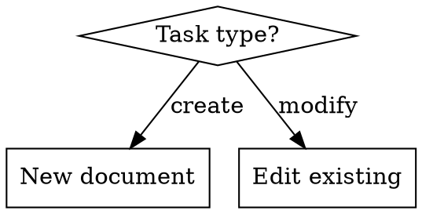

# Workflow Patterns

**Load this reference when:** designing skills with multi-step processes or conditional logic.

## Sequential Workflows

For complex tasks, break operations into clear, sequential steps. Provide an overview of the process towards the beginning of SKILL.md:

```markdown
Filling a PDF form involves these steps:

1. Analyze the form (run analyze_form.py)
2. Create field mapping (edit fields.json)
3. Validate mapping (run validate_fields.py)
4. Fill the form (run fill_form.py)
5. Verify output (run verify_output.py)
```

## Conditional Workflows

For tasks with branching logic, guide Claude through decision points:

```markdown
1. Determine the modification type:
   **Creating new content?** → Follow "Creation workflow" below
   **Editing existing content?** → Follow "Editing workflow" below

2. Creation workflow: [steps]
3. Editing workflow: [steps]
```

## Checklist Pattern

For multi-step workflows, provide a checklist Claude can track:

```markdown
## Research Synthesis Workflow

Copy this checklist and track progress:

```
Research Progress:
- [ ] Step 1: Read all source documents
- [ ] Step 2: Identify key themes
- [ ] Step 3: Cross-reference claims
- [ ] Step 4: Create structured summary
- [ ] Step 5: Verify citations
```
```

## Feedback Loop Pattern

For quality-critical tasks, implement validate → fix → repeat:

```markdown
## Document Editing Process

1. Make edits to `word/document.xml`
2. **Validate immediately**: `python scripts/validate.py unpacked_dir/`
3. If validation fails:
   - Review the error message carefully
   - Fix the issues in the XML
   - Run validation again
4. **Only proceed when validation passes**
5. Rebuild: `python scripts/pack.py unpacked_dir/ output.docx`
```

## Plan-Validate-Execute Pattern

For complex, error-prone tasks:

1. **Plan**: Create intermediate output (e.g., `changes.json`)
2. **Validate**: Run validation script on the plan
3. **Execute**: Apply changes only after validation passes

```markdown
## Batch Update Workflow

1. Analyze → create `changes.json` plan file
2. Validate → `python scripts/validate_changes.py changes.json`
3. Execute → `python scripts/apply_changes.py changes.json`
4. Verify → check output meets expectations
```

Benefits:
- Catches errors early
- Machine-verifiable
- Reversible planning phase
- Clear debugging

## Decision Trees

For non-obvious decisions, use small inline flowcharts:



Use flowcharts ONLY for:
- Non-obvious decision points
- Process loops where you might stop too early
- "When to use A vs B" decisions

Never use flowcharts for:
- Reference material → use tables/lists
- Code examples → use markdown blocks
- Linear instructions → use numbered lists
