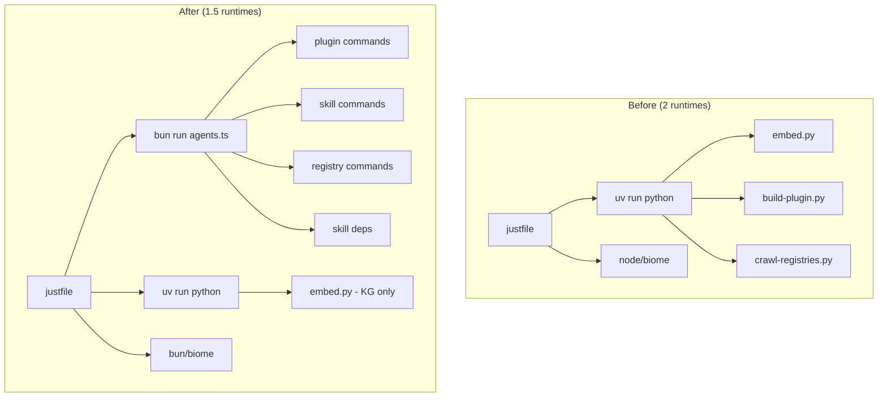

# ADR-011: Adopt Bun and TypeScript for Project Scripting

## Status

Accepted (2026-03-18)

## Context

The project's `.scripts/` directory contained 8 Python scripts for plugin building, knowledge graph embedding, registry crawling, and utility operations. The project also requires Node.js/Bun for JavaScript/TypeScript linting (biome) and the Claude Code ecosystem (plugins, skills, commands) is JavaScript/TypeScript-native.

Running both Python (`uv`) and Node/Bun runtimes increases the toolchain surface, slows `just init`, and creates cognitive friction when the domain (Claude Code components) is TypeScript-native.

**Why now:** Planning a new external skill dependency tracking system that needs GitHub API integration, symlink management, and lockfile logic — capabilities better served by TypeScript's type system and the Octokit ecosystem.

## Decision Drivers

1. **Ecosystem alignment** — Claude Code components are JS/TS-native; tooling should match
2. **Runtime consolidation** — reduce from 2 runtimes to 1 (or 1.5 with KG fallback)
3. **Type safety** — TypeScript provides compile-time validation for JSON manifests and lockfiles
4. **Bun performance** — faster startup than Python for CLI scripts invoked frequently via `just`
5. **Dependency weight** — Python's optional deps (torch, sentence-transformers) are ~2GB

## Considered Options

### Option 1: Stay with Python

Keep all scripts in Python, add new features (skill deps) in Python too.

- **Pro:** No migration cost, existing code works
- **Pro:** sqlite-vec has first-class Python bindings
- **Con:** Two runtimes required (Python + Node for biome)
- **Con:** Type enforcement is opt-in (mypy not in dev deps)
- **Con:** Ecosystem mismatch with Claude Code's JS/TS nature

### Option 2: Migrate to TypeScript with Bun (chosen)

Port all scripts to TypeScript, use Bun as the runtime.

- **Pro:** Single runtime for scripting + linting
- **Pro:** Native JSON/TypeScript type inference via Valibot schemas
- **Pro:** Bun startup ~5x faster than Python for CLI invocations
- **Pro:** `fetch` is native (no httpx dependency)
- **Con:** sqlite-vec incompatible with Bun (KG stays in Python)
- **Con:** Citty CLI framework is pre-1.0

### Option 3: Migrate to TypeScript with Node.js

Same as Option 2 but with Node.js instead of Bun.

- **Pro:** More mature runtime, better-sqlite3 works
- **Pro:** Larger ecosystem compatibility
- **Con:** Slower startup than Bun
- **Con:** Need separate test runner (jest/vitest), no built-in `bun:test`
- **Con:** No built-in `Bun.file()`, `Bun.CryptoHasher`, `Bun.write()`

## Decision Outcome

Chose **Option 2: Migrate to TypeScript with Bun**, with a fallback: the Knowledge Graph system stays in Python because sqlite-vec cannot load as a dynamic extension in Bun (neither `better-sqlite3` nor `bun:sqlite` support it).

## Diagram

## Consequences

### Positive

- Unified CLI (`ai-tools`) with 25+ subcommands replaces 8 separate scripts
- 421 tests in 600ms (Bun test runner is fast)
- Type-safe JSON validation via Valibot schemas with inferred types
- New capability: external skill tracking with drift detection
- 12 lightweight deps vs Python's 10+ (no torch/sentence-transformers)

### Negative

- Knowledge graph system cannot migrate (sqlite-vec/Bun incompatibility)
- `pyproject.toml` and `uv` remain in the toolchain for KG
- Citty (CLI framework) is pre-1.0 — API may change
- `just init` now runs both `_init-bun` and `_init-python`

### Neutral

- Human-readable CLI output differs from Python's `rich` (JSON mode is the machine contract)
- Bun's `better-sqlite3` support tracked at oven-sh/bun#4290 — may resolve in future
