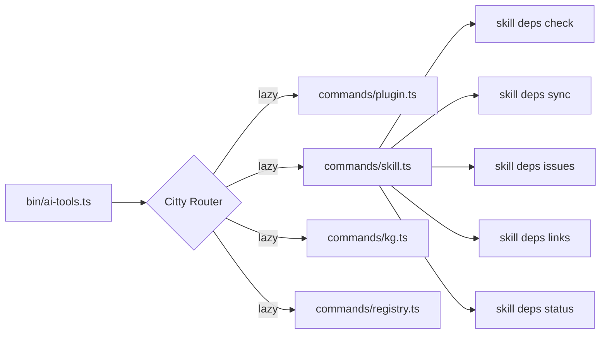

# ADR-012: Use Citty for Unified CLI Framework

## Status

Accepted (2026-03-18)

## Context

The TypeScript migration (ADR-011) requires a CLI framework to replace the multiple Python script entry points with a single `ai-tools` binary. The CLI needs: subcommand nesting (noun → verb), lazy loading, TypeScript-native types, async-first design, and Bun compatibility.

## Decision Drivers

1. **Bundle size** — CLI tool should start fast; framework overhead matters
2. **Bun compatibility** — must work natively, not through compatibility shims
3. **TypeScript-first** — types inferred from definitions, not bolted on
4. **Lazy loading** — `ai-tools kg search` shouldn't load Octokit
5. **Zero dependencies** — minimize supply chain surface

## Considered Options

### Option 1: Commander.js

The most popular CLI framework (28K GitHub stars, v14).

- **Pro:** Most features (global options via `.optsWithGlobals()`, hooks, env vars, completions via third-party)
- **Pro:** Very stable (14 major versions)
- **Pro:** Zero dependencies
- **Con:** 11.5 KB gzipped (4x Citty)
- **Con:** TypeScript inference requires separate `@commander-js/extra-typings` package
- **Con:** Async is bolted on (`.parseAsync()`)

### Option 2: Yargs

Second most popular (11.5K stars, v18).

- **Pro:** Built-in shell completions, i18n, `.example()` API
- **Con:** 31.9 KB gzipped, 6 dependencies
- **Con:** Bun compatibility issues (`$0` returns `"bun"`, not script name)
- **Con:** External `@types/yargs` needed for TypeScript

### Option 3: Citty (chosen)

UnJS ecosystem (1.1K stars, v0.2.1, backed by Nuxt org).

- **Pro:** 2.9 KB gzipped — 4x smaller than Commander, 11x smaller than Yargs
- **Pro:** Zero dependencies, uses native `node:util parseArgs`
- **Pro:** TypeScript-native (written in 100% TypeScript, types inferred from `defineCommand`)
- **Pro:** Async-first — `Resolvable<T>` pattern makes lazy loading first-class
- **Pro:** Explicit Bun support (UnJS targets cross-runtime compatibility)
- **Con:** Pre-1.0 (v0.2.1) — API not guaranteed stable
- **Con:** No built-in global option inheritance (solved with Nuxi spread pattern)
- **Con:** No built-in env var support (solved with `envDefault` utility, ~10 LOC)
- **Con:** No built-in shell completions (solved with `@bomb.sh/tab` Citty adapter)

## Decision Outcome

Chose **Option 3: Citty** for its minimal footprint, TypeScript-native design, and Bun-first philosophy. The missing features (global options, env vars, completions) are addressed with lightweight patterns:

- **Global options:** Spread shared arg objects into each leaf command (Nuxi pattern, ~5 LOC)
- **Env vars:** `envDefault()` utility reads `process.env` in arg defaults (~10 LOC)
- **Completions:** `@bomb.sh/tab` with its native Citty adapter

## Diagram

## Consequences

### Positive

- Near-zero startup overhead (<1ms framework cost)
- All subcommands lazy-loaded via `() => import('./command')`
- Type inference works without extra packages
- Citty is backed by UnJS/Nuxt organization (institutional support)

### Negative

- Pre-1.0 risk — pinned in `bun.lock` to mitigate
- Must spread global args into every leaf command (minor boilerplate)
- No shell completions without `@bomb.sh/tab` (extra dependency)

### Neutral

- Citty's plugin system exists but is minimal — we use spread pattern instead
