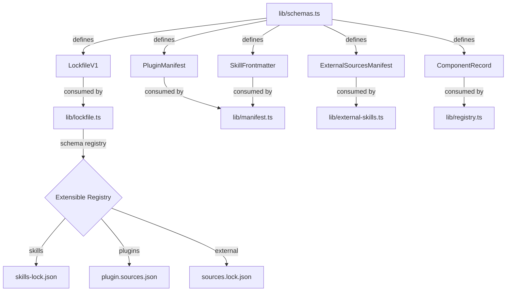

# ADR-013: Use Valibot for Schema Validation and Type Inference

## Status

Accepted (2026-03-18)

## Context

The TypeScript migration (ADR-011) needs runtime validation for JSON lockfiles, plugin manifests, skill frontmatter, and registry records. Python used ad-hoc `json.loads()` with manual type checking. TypeScript needs a library that validates at runtime AND infers TypeScript types from schema definitions (the Pydantic equivalent).

## Decision Drivers

1. **Bundle size** — CLI tool, every KB matters for cold start
2. **Zero dependencies** — minimize supply chain surface
3. **Type inference** — define schema once, get TypeScript type for free
4. **Tree-shakeable** — only pay for validators you import
5. **Structured errors** — dot-path error messages for user-friendly CLI output

## Considered Options

### Option 1: Zod v4

The dominant schema validation library.

- **Pro:** Massive ecosystem (trpc, drizzle, react-hook-form integrations)
- **Pro:** `.toJSONSchema()` built-in
- **Pro:** Zero dependencies
- **Con:** 12 KB gzipped (full), ~1.9 KB (zod-mini)
- **Con:** Not fully tree-shakeable (mini variant is, but limited)

### Option 2: Valibot (chosen)

Modular functional validation library.

- **Pro:** ~1.4 KB gzipped for realistic usage (best-in-class tree-shaking)
- **Pro:** Zero dependencies
- **Pro:** Full `InferOutput` type inference
- **Pro:** Structured validation issues with dot-path locations
- **Pro:** `v.pipe()` for composing validators with cross-field checks
- **Con:** Smaller ecosystem than Zod
- **Con:** Functional API (not chainable like Zod's `z.string().min(1)`)

### Option 3: ArkType

JIT-compiled validation with TypeScript-like syntax.

- **Pro:** Fastest runtime performance (3-4x faster than Zod)
- **Pro:** Zero dependencies
- **Con:** 40 KB gzipped (largest option — includes JIT compiler)
- **Con:** Designed for hot-path validation, overkill for CLI config files

### Option 4: TypeBox

JSON Schema-native validation.

- **Pro:** Schemas ARE JSON Schema objects (portable)
- **Pro:** ~3x faster than Zod
- **Con:** 8-24 KB depending on modules used
- **Con:** Not tree-shakeable (planned for 1.0)

## Decision Outcome

Chose **Option 2: Valibot** for its minimal footprint and architectural tree-shaking. For a CLI that validates a handful of config files per invocation, Valibot's modular design means we only ship the validators we actually use.

Key usage: lockfile schemas (with extensible registry pattern), plugin manifest validation, skill frontmatter parsing, and the external skill tracking system's `sources.yaml` manifest.

## Diagram

## Consequences

### Positive

- Schemas define both runtime validation AND TypeScript types in one place
- `v.InferOutput<typeof Schema>` eliminates manual type definitions
- Structured error messages with dot-paths: `"author.email: Invalid email"`
- Cross-field validation via `v.pipe()` + `v.check()` (e.g., passthrough/derived_by mutual exclusivity)
- Tree-shaking means unused validators are eliminated from the bundle

### Negative

- Smaller ecosystem — fewer third-party integrations than Zod
- Functional API is less familiar to developers used to Zod's chainable style
- JSON Schema export requires separate `@valibot/to-json-schema` package

### Neutral

- Performance difference between Valibot and Zod is negligible for CLI use (microseconds)
