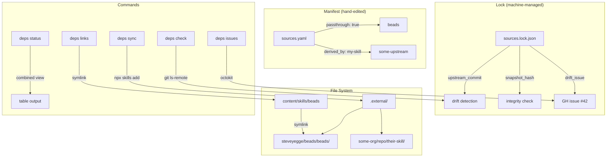

# ADR-014: Adopt Two-Mode External Skill Tracking with Drift Detection

## Status

Accepted (2026-03-18)

## Context

The project vendors external skills from other repositories (e.g., `beads` from `steveyegge/beads`). Previously tracked via simple `skills-lock.json` with content hashes, but no mechanism existed to:

- Detect when upstream skills change
- Distinguish between "use upstream directly" vs "derive a local variant"
- Automatically create review tasks when upstream drifts from local derivatives
- Manage symlinks for passthrough skills

## Decision Drivers

1. **Two usage modes** — some skills are used as-is (passthrough), others are locally modified (derived)
2. **Drift detection without downloading** — `git ls-remote` is cheaper than cloning
3. **Review workflow** — changes to upstream should create trackable GitHub issues
4. **Discovery isolation** — vendored snapshots must not appear in `npx skills ls`
5. **Rename resilience** — renaming a skill in the manifest shouldn't lose tracking history

## Considered Options

### Option 1: Flat lockfile with hash tracking

Extend the existing `skills-lock.json` with upstream commit tracking.

- **Pro:** Simple, single file
- **Con:** No distinction between passthrough and derived modes
- **Con:** No manifest for declaring intent — everything inferred from hashes
- **Con:** Name-based keys break on rename

### Option 2: Two-file system with manifest + lock (chosen)

Hand-edited `sources.yaml` manifest declares intent (passthrough/derived), machine-managed `sources.lock.json` tracks state (commits, hashes, issues).

- **Pro:** Clear separation of intent (manifest) from state (lock)
- **Pro:** Content-hash lock keys enable rename without losing history
- **Pro:** Two-hash system: `upstream_commit` for drift detection, `snapshot_hash` for integrity
- **Pro:** `derived_by` field explicitly links upstream to local skills
- **Con:** Two files to maintain (but only manifest is hand-edited)
- **Con:** More complex than Option 1

### Option 3: Git submodules

Use git submodules for external skills.

- **Pro:** Built-in to git, well-understood
- **Con:** Submodules are notoriously painful (detached HEAD, forgotten updates)
- **Con:** No passthrough/derived distinction
- **Con:** No GitHub issue integration for drift review

## Decision Outcome

Chose **Option 2: Two-file manifest + lock system** with:

- `.external/sources.yaml` — hand-edited manifest declaring each skill's source, mode, and dependencies
- `.external/sources.lock.json` — machine-managed lock with content-hash keys
- `.external/<owner>/<repo>/<skill>/` — committed snapshots
- Passthrough skills get symlinks in `content/skills/<name>`
- Derived skills get GitHub issues on drift

## Diagram

## Consequences

### Positive

- Clear intent declaration: passthrough vs derived is explicit, not inferred
- Cheap drift detection: `git ls-remote` checks remote commit without downloading
- Rename resilience: lock keys are content-hashes, not skill names
- Review workflow: drift creates GitHub issues with diff blocks, grouped by local skill
- Discovery isolation: `.external/` is a dotdir, invisible to `npx skills ls`
- Justfile module: `just skill external:update` runs the full sync → issues → links → status workflow

### Negative

- `passthrough` and `derived_by` are mutually exclusive — a skill cannot be both (must create two manifest entries if needed)
- Requires GitHub auth (Device Flow or `gh auth token`) for issue creation
- `npx skills add` must be available for non-pinned skill fetching (falls back to `git clone`)

### Neutral

- Lock file uses JSON (consistent with project lockfiles), manifest uses YAML (human-friendly for editing)
- `ref` field supports tag/SHA pinning for archived repos — content at pinned refs is immutable, so only CURRENT or UNAVAIL states exist
