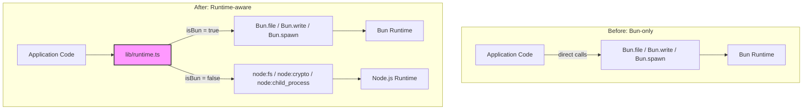

# ADR-016: Add Runtime-Aware Shims for Cross-Runtime Compatibility

## Status

Accepted (2026-03-19)

## Context

ADR-011 chose Bun as the sole runtime for `.scripts/`, using Bun-specific APIs throughout: `Bun.file()`, `Bun.write()`, `Bun.spawnSync()`, `Bun.spawn()`, `Bun.CryptoHasher`, `Bun.Glob`, and `import.meta.dir`. This worked well for local development but created a hard dependency — the `@arustydev/agents` package could not run under Node.js at all.

Publishing to npm requires Node.js compatibility. Users installing via `npx @arustydev/agents` would get immediate runtime failures because `globalThis.Bun` is undefined under Node.

**Why now:** Issue `ai-x9y.3` called for npm publishing with CI/CD. Analysis of the codebase identified 6 categories of Bun-specific API usage across 16 files that would fail under Node.js.

## Decision Drivers

1. **npm publishability** — `npx` must work, not just `bunx`
2. **Preserve Bun advantages** — Bun users should still get native performance (faster file I/O, native crypto)
3. **Minimal refactor surface** — shim layer should be a drop-in replacement, not a rewrite
4. **No build step** — avoid transpilation or bundling; runtime detection only
5. **Single codebase** — no conditional compilation, no separate builds per runtime

## Considered Options

### Option 1: Bun-only publishing

Publish to npm but document "requires Bun" in package.json `engines` field.

- **Pro:** Zero code changes
- **Pro:** Bun is available via `npm i -g bun` on all platforms
- **Con:** `npx` users get cryptic failures (`Bun is not defined`)
- **Con:** CI environments often have Node.js but not Bun
- **Con:** Limits adoption to Bun-aware users

### Option 2: Compile to Node-compatible bundle

Use `bun build --target=node` to strip Bun APIs at build time.

- **Pro:** Single output file, no runtime detection
- **Con:** Loses Bun performance advantages for Bun users
- **Con:** Adds build step to publish workflow
- **Con:** Source maps and debugging become harder
- **Con:** Tree-shaking may miss dynamic imports

### Option 3: Runtime-aware shim layer (chosen)

Create `lib/runtime.ts` that detects `typeof globalThis.Bun !== 'undefined'` at runtime and branches to optimal APIs for each runtime.

- **Pro:** Both runtimes work from the same source
- **Pro:** Bun users keep native performance (faster file I/O, native crypto hasher)
- **Pro:** Node users get standard library equivalents that work correctly
- **Pro:** No build step — works with both `bun run` and `node --import tsx`
- **Con:** Each shim function has a branch — minor overhead on first call
- **Con:** Must maintain two code paths per operation
- **Con:** Node path for `createServer` required rewriting `Bun.serve()` to `node:http` + `ws`

### Option 4: Polyfill Bun globals under Node

Create a `bun-polyfill` module that stubs `globalThis.Bun` with Node equivalents.

- **Pro:** Existing code unchanged — polyfill injected at startup
- **Con:** Bun's API surface is large and undocumented for polyfill purposes
- **Con:** Fragile — Bun API changes would silently break the polyfill
- **Con:** `Bun.serve()` WebSocket API has no clean Node equivalent as a polyfill

## Decision Outcome

Chose **Option 3: Runtime-aware shim layer**. Created `lib/runtime.ts` exporting async/sync functions that detect the runtime once and branch accordingly.

### Shim Coverage

| Bun API | Node.js Equivalent | Shim Function |
|---------|--------------------|---------------|
| `Bun.file(path).text()` | `fs/promises.readFile` | `readText()` |
| `Bun.file(path).json()` | `readFile` + `JSON.parse` | `readJson()` |
| `Bun.write(path, data)` | `fs/promises.writeFile` | `writeText()` |
| `Bun.file(path).exists()` | `fs/promises.access` | `fileExists()` |
| `Bun.file(path).stream()` | `fs.createReadStream` → `ReadableStream` | `fileStream()` |
| `new Bun.CryptoHasher('sha256')` | `crypto.createHash('sha256')` | `createSha256Hasher()` |
| `Bun.spawnSync(cmd)` | `child_process.spawnSync` | `spawnSync()` |
| `Bun.spawn(cmd)` | `child_process.spawn` | `spawnAsync()` |
| `import.meta.dir` | `import.meta.dirname` / `fileURLToPath` | `currentDir()` |
| `new Bun.Glob(pattern)` | `fast-glob` + `picomatch` | (direct replacement) |
| `Bun.serve()` | `node:http` + `ws` package | (graph-viewer rewrite) |

### Additional Dependencies

- `ws` — WebSocket server for Node.js (Bun has built-in WebSocket in `Bun.serve()`)
- `fast-glob` — cross-runtime glob matching (replaces `new Bun.Glob()`)

## Diagram

## Consequences

### Positive

- Package is now publishable to npm — works with both `npx` and `bunx`
- Bun users retain native performance advantages (file I/O, crypto, spawn)
- Single codebase — no conditional compilation or separate builds
- Runtime detection is a one-time `typeof` check, negligible overhead
- Forced cleanup of pre-existing biome lint issues across 16 files

### Negative

- Two code paths per shim function — both must be tested
- `node:http` + `ws` server is more verbose than `Bun.serve()` (~50 extra lines)
- Added 2 runtime dependencies (`ws`, `fast-glob`) that Bun doesn't need
- Node.js path for `spawnAsync` uses callback-based streams wrapped in Promises
- `createSha256Hasher` uses synchronous `require()` on the Node path (dynamic import not viable for sync API)

### Neutral

- The `isBun` constant is module-level and evaluated once at import time
- Graph viewer server works identically on both runtimes (tested manually)
- The shim pattern could be extracted to a standalone package if other projects need it
