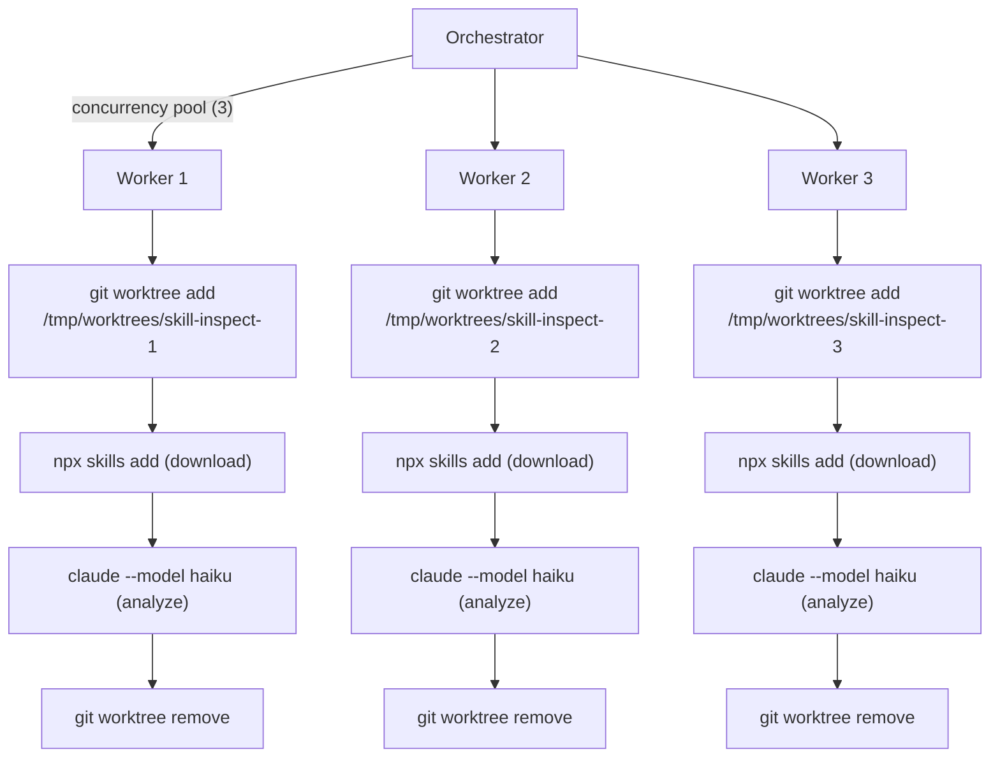

# ADR-017: Use Git Worktrees for Parallel Agent Orchestration

## Status

Accepted

## Context

The Skill Catalog Inspection Pipeline dispatches Haiku agents to analyze ~12,000 external skills. Each agent runs `npx skills add` to download skills, then analyzes the SKILL.md files. At batch size 25 with ~470 batches, sequential execution would take ~13 hours. We needed parallel execution, but `npx skills add` writes to `.claude/skills/` in the working directory — concurrent agents would collide on the filesystem.

**Constraints:**
- Agents need a git repository context (Claude Code reads CLAUDE.md, settings, etc.)
- `npx skills add` writes to the repo's `.claude/skills/` directory
- Multiple agents must run concurrently without filesystem collisions
- Cleanup must be reliable even if the process is killed mid-batch

## Decision Drivers

1. **Isolation** — each agent must have its own writable copy of the repo
2. **Performance** — creation/teardown overhead must be low relative to batch runtime
3. **Cleanup** — stale artifacts must not accumulate across runs
4. **Simplicity** — should use existing tools, not introduce new infrastructure

## Considered Options

### Option 1: Sequential Execution (No Isolation)

Run one agent at a time. No filesystem conflicts.

- Pro: Zero complexity
- Con: ~13 hours for 470 batches at ~1.5 min/batch. Unacceptable.

### Option 2: Temporary Directories (mkdtemp)

Create temp dirs and copy necessary files into them.

- Pro: Simple, no git dependency
- Con: Agents lose git context (CLAUDE.md, settings). `claude` CLI expects a git repo. Would need to `git init` + copy config, adding complexity.

### Option 3: Docker Containers

Spin up a container per batch with the repo mounted read-only and a writable overlay.

- Pro: Strong isolation, reproducible
- Con: Requires Docker, adds ~10s startup per container, heavy for a CLI tool running locally

### Option 4: Git Worktrees (Chosen)

`git worktree add --detach /tmp/worktrees/skill-inspect-<N> HEAD` creates a lightweight checkout sharing the same git objects. Each worktree is a full working copy.

- Pro: Full git context (CLAUDE.md, settings, hooks), ~5s creation, shared git objects (disk-efficient), `git worktree remove` for cleanup
- Con: Worktrees show in `git worktree list`, stale worktrees can accumulate if process is killed

## Decision Outcome

**Use git worktrees** for parallel agent dispatch.

Each batch gets its own worktree at `/tmp/worktrees/skill-inspect-<batchNum>/`. The orchestrator creates worktrees with `git worktree add --detach`, runs `npx skills add` and `claude` within the worktree, then removes it with `git worktree remove --force` in a `finally` block.

A `catalog cleanup` CLI command handles stale worktrees from interrupted runs.

## Consequences

**Positive:**
- 3x throughput with concurrency 3 (~4-5 hours vs 13 hours)
- Each agent sees full repo context including CLAUDE.md and settings
- No new infrastructure dependencies — uses git, which is already present
- Disk-efficient — worktrees share git objects

**Negative:**
- ~5s overhead per worktree creation (5,677 files checked out)
- Stale worktrees accumulate if process is killed — requires manual cleanup or `catalog cleanup`
- `/tmp/worktrees/` directory must be writable

**Neutral:**
- Worktree count limited by disk I/O, not a hard limit — 3 concurrent is the practical sweet spot for this workload
