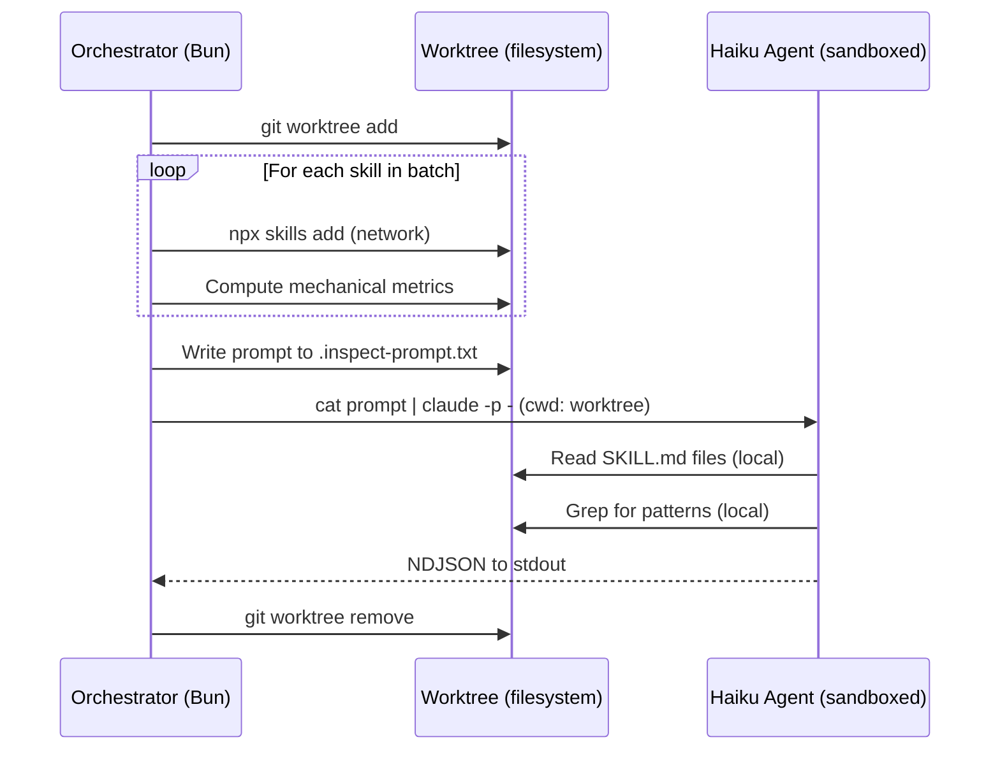

# ADR-018: Split Network and Analysis Responsibilities Between Orchestrator and Agent

## Status

Accepted

## Context

The Skill Catalog Pipeline dispatches Claude Code Haiku agents to analyze external skills. The initial design had agents handle everything: download skills via `npx skills add`, read files, compute metrics, and output NDJSON. This failed because `claude -p` runs in a sandboxed mode that blocks network access for child processes — `npx skills add` couldn't reach GitHub.

**Discovery:** The first test batch returned all errors: "sandbox network restrictions prevented skill downloads." The agent could read local files and run local tools, but any command requiring network access was blocked.

**Constraints:**
- `npx skills add` requires network access to download from GitHub
- `claude -p` sandbox restricts network for Bash tool calls
- The orchestrator (Bun process) has full network access
- We don't want to use `--dangerously-skip-permissions` for 470+ agent invocations

## Decision Drivers

1. **Security** — agents should have minimal permissions, not broad network access
2. **Reliability** — network operations should be handled by code we control, not by an LLM
3. **Debuggability** — download failures should be captured at the orchestrator level with full error context
4. **Reusability** — the pattern should work for future pipelines that need external data + agent analysis

## Considered Options

### Option 1: Grant Agents Network Access

Use `--dangerously-skip-permissions` or `--allowedTools "Bash(*)"` to let agents download skills themselves.

- Pro: Simple, matches the original agent design
- Con: Bypasses sandbox for hundreds of agent invocations, agents make network calls we can't control or retry, download errors are mixed with analysis errors

### Option 2: Pre-download in Orchestrator, Analyze in Agent (Chosen)

The orchestrator handles all network operations (download skills via `npx skills add` in the worktree). The agent receives pre-downloaded files and only does analysis work with restricted tools.

- Pro: Network access stays in controlled code, agent has minimal permissions, download errors are captured with full stderr, clear separation of concerns
- Con: Two-phase batch processing, manifest must include local file paths

### Option 3: Fetch SKILL.md via Raw GitHub URLs

Skip `npx skills add` entirely. The orchestrator fetches SKILL.md files directly via `https://raw.githubusercontent.com/...` using `fetch()`.

- Pro: No `npx` dependency, faster (single HTTP request per skill vs full npm install)
- Con: Guessing the correct branch and path. Skills may be at `.claude/skills/<name>/SKILL.md` or other locations. `npx skills add` handles this resolution. Would need to replicate its logic.

## Decision Outcome

**Split responsibilities: orchestrator downloads, agent analyzes.**

The orchestrator runs `npx skills add` in the worktree (with full network access), then writes the agent prompt to a file and pipes it via `cat prompt.txt | claude --model haiku --allowedTools "Read Glob Grep" -p -`. The agent sees pre-downloaded files at known local paths and needs only read access.

## Consequences

**Positive:**
- Agent runs with minimal permissions (`Read Glob Grep` only, no Bash, no network)
- Download errors are captured with full stderr at the orchestrator level, not buried in agent output
- Downloads are retryable independently of analysis
- Pattern is reusable: any future pipeline that needs "fetch external data + analyze with agent" can follow the same split

**Negative:**
- Each batch has two sequential phases (download, then analyze) — can't overlap them within a batch
- The orchestrator must construct a manifest mapping skill references to local paths

**Neutral:**
- `npx skills add` is treated as a black box — we don't replicate its GitHub resolution logic
- The agent prompt must include local file paths instead of `org/repo@skill` references
