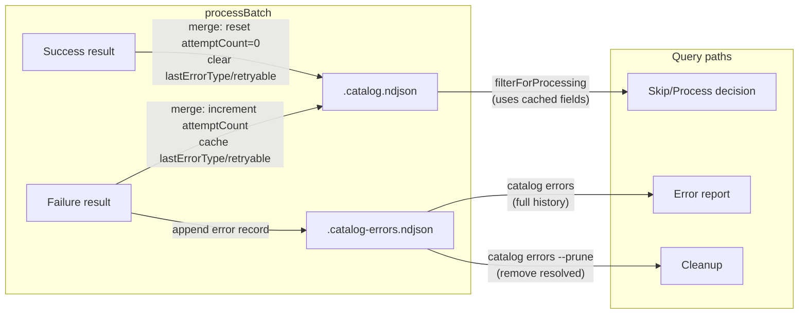

# ADR-019: Use Append-Only Error Log Separate from Catalog

## Status

Accepted

## Context

After processing ~3,500 skills, the catalog (`.catalog.ndjson`) contained 1,623 entries with both valid analysis data (`wordCount`) AND lingering error fields from prior failed runs. The merge strategy `{ ...existing, ...newResult }` overwrites matching fields but doesn't clear old fields that aren't present in the new result. When a skill fails in run A and succeeds in run B, the error fields from run A persist alongside the success data from run B.

This made error reporting unreliable — `catalog errors` reported 2,598 errors, but ~1,600 of them were stale. We also lost error history: when a skill succeeded, its previous error was silently overwritten.

**Requirements:**
- Error reports must be accurate (no stale errors on successful entries)
- Error history must be preserved for debugging (why did a skill fail 3 times before succeeding?)
- The catalog must be queryable without loading a separate error index
- Retry logic needs to know: is this error retryable? how many times has it been attempted?

## Decision Drivers

1. **Data integrity** — catalog entries must not carry contradictory state (data + error)
2. **Audit trail** — error history should be preserved, not overwritten
3. **Query performance** — common operations (filter for processing, show summary) should not require reading the full error log
4. **Simplicity** — stay in the NDJSON ecosystem, no new databases

## Considered Options

### Option 1: Fix Merge to Clear Error Fields on Success

On successful merge, explicitly `delete` error fields from the entry.

- Pro: Simple fix, no new files
- Con: Loses error history. No way to see that a skill failed 3 times before succeeding. Also doesn't solve the "when was this error, which run?" question.

### Option 2: Same File, Different Record Types

Add a `type: "error"` field to distinguish error records from analysis records in `.catalog.ndjson`.

- Pro: Single file, queryable with `jq 'select(.type == "error")'`
- Con: Catalog file grows faster, mixes concerns, `wc -l` no longer equals "number of skills"

### Option 3: Separate Append-Only NDJSON Error Log (Chosen)

Errors go to `.catalog-errors.ndjson`. Catalog entries carry only `attemptCount`, `lastErrorType`, `retryable` as cached fields for performance.

- Pro: Clean catalog (only analysis results), full error history preserved, append-only is simple and auditable, cached fields avoid reading error log for filtering
- Con: Two files to manage, cached fields can drift from error log (mitigated by merge logic)

### Option 4: SQLite Error Database

Store errors in a SQLite table with foreign keys.

- Pro: Most queryable, supports complex aggregations
- Con: Adds dependency, breaks the "NDJSON is source of truth" pattern, overkill for append-only error records

## Decision Outcome

**Separate append-only NDJSON error log** at `content/skills/.catalog-errors.ndjson`.

Catalog entries carry `attemptCount` (number), `lastErrorType` (string), and `retryable` (boolean) as a performance cache. These are set during merge and allow `filterForProcessing` to work without reading the error log. The error log is the source of truth for full error history.

**`attemptCount` lifecycle:**
- Starts at 0 (never attempted)
- Incremented on each failure
- Reset to 0 on success
- Skip threshold: >= 2 unless `--force`

## Consequences

**Positive:**
- Catalog is clean — no entries with contradictory data + error state
- Full error history preserved — can trace a skill through multiple failures to eventual success
- `filterForProcessing` is fast — reads only catalog fields, not the error log
- Error log is append-only — simple, auditable, no concurrent write conflicts

**Negative:**
- Two files to manage instead of one
- Cached fields (`lastErrorType`, `retryable`) on catalog entries can theoretically drift from error log — mitigated by the merge logic always updating both
- Error log grows unbounded — `catalog errors --prune` provided for opt-in cleanup

**Neutral:**
- ~50 bytes per error record — at 10K errors the log is ~500KB, not a concern
- Backfill required for existing data via `catalog scrub` command
