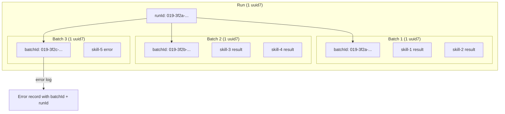

# ADR-020: Use UUID v7 for Batch and Run Correlation

## Status

Accepted

## Context

The Skill Catalog Pipeline dispatches hundreds of agent batches across multiple runs. After processing ~3,500 skills, we could not answer basic operational questions:

- Which run produced this result?
- Which skills were in the same batch?
- Did this batch run before or after that one?
- Which run's errors should be retried?

Error messages embedded worktree paths like `skill-inspect-107`, but worktree numbers restart each run and batch boundaries shift as the catalog grows. There was no stable identifier tying results to their provenance.

**Requirements:**
- Every result and error must be traceable to a specific batch and run
- Batches must be sortable chronologically
- IDs must be unique across runs without coordination

## Decision Drivers

1. **Traceability** — results and errors must be traceable to their batch and run
2. **Sortability** — IDs should be chronologically sortable without a separate timestamp field
3. **Uniqueness** — no coordination needed between concurrent workers or sequential runs
4. **Existing tooling** — prefer what's already in the codebase

## Considered Options

### Option 1: Incrementing Counters

`runId: 1`, `batchId: 42`. Simple integers.

- Pro: Human-readable, compact
- Con: Requires coordination (where does the counter live?). Resets across process restarts. Not globally unique.

### Option 2: UUID v4 (Random)

`runId: "a1b2c3d4-..."`. Pure random.

- Pro: Globally unique, no coordination
- Con: Not sortable. Can't tell which run came first without a separate timestamp.

### Option 3: Timestamps

`runId: "2026-03-19T14:30:00Z"`. ISO timestamps.

- Pro: Sortable, human-readable
- Con: Not unique — two runs started in the same second collide. Millisecond precision helps but doesn't guarantee uniqueness.

### Option 4: UUID v7 (Chosen)

`runId: "019..."`. Timestamp-sortable, unique, already implemented in `cli/lib/uuid.ts`.

- Pro: Chronologically sortable (first 48 bits are millisecond timestamp), globally unique (random suffix), already in the codebase with tests
- Con: Not human-readable at a glance (but the embedded timestamp can be extracted)

## Decision Outcome

**Use UUID v7** for `runId` and `batchId` fields. The implementation already exists at `cli/lib/uuid.ts` with full test coverage.

**Where each ID is generated:**
- `runId`: once at the top of `catalog analyze`, shared by all batches in that invocation
- `batchId`: once per batch in `processBatch`, shared by all results/errors in that batch
- `analyzedAt`: ISO timestamp, set alongside `batchId` for human readability

**Where UUID v7 should be used in this project:**

| Use Case | ID Field | Scope |
|---|---|---|
| Catalog analysis runs | `runId` | One per `analyze` invocation |
| Catalog analysis batches | `batchId` | One per `processBatch` call |
| Error log entries | `runId` + `batchId` | Inherited from the batch that produced the error |
| Beads issues | `id` | Already uses UUIDs (v4 currently — candidate for v7 migration) |
| Plan/phase documents | `id` in frontmatter | Already uses UUIDs (v4 currently) |

**When to prefer UUID v7 over v4:**
- When records need to be sorted chronologically (logs, events, audit trails)
- When you need to correlate records across files without a shared counter
- When the ID will be used in queries like "show all results from the last run"

**When UUID v4 is fine:**
- Document identifiers that don't need temporal ordering (ADR IDs, plan IDs)
- One-off identifiers that won't be queried in time-series contexts

## Consequences

**Positive:**
- Every result and error is traceable to its exact batch and run
- `jq 'select(.runId == "019...")' .catalog.ndjson` — query all results from a specific run
- `jq 'select(.batchId == "019...")' .catalog-errors.ndjson` — find all errors from a failed batch
- Batches sort chronologically by `batchId` string comparison (uuid7 property)
- No coordination needed — concurrent workers generate unique IDs independently

**Negative:**
- UUIDs are 36 chars per field — adds ~150 bytes per catalog entry (3 fields: runId, batchId, analyzedAt). Minimal impact on a ~50KB/1000-entry catalog.
- Not human-readable at a glance — mitigated by `analyzedAt` ISO timestamp alongside

**Neutral:**
- The `uuid7()` implementation uses `Bun.randomUUIDv7()` under the hood if available, falling back to a manual implementation. Already tested in `cli/test/uuid.test.ts`.
