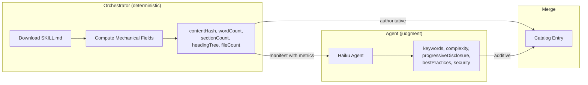

# ADR-021: Use Native TypeScript for Mechanical Computation Instead of LLM Delegation

## Status

Accepted

## Context

The Skill Catalog Pipeline's Tier 1 analysis originally delegated all work to a Haiku agent, including mechanical operations: computing SHA-256 hashes, counting words, counting headings, counting files, and determining file structure. After analyzing ~3,500 skills, we found:

- 77 entries had `sha256:pending` instead of real content hashes — the agent didn't run `shasum`
- 348 entries were missing keywords — the agent skipped extraction on some batches
- Every batch wrapped NDJSON output in markdown prose, wasting tokens and risking parse failures
- The agent was granted `Bash(wc:*,find:*,stat:*,sha256sum:*,shasum:*)` tools to perform operations that are trivially deterministic

**Core insight:** Asking an LLM to shell out to `wc -w` and parse the result is strictly worse than calling `content.split(/\s+/).length` in the orchestrator. The LLM adds latency, cost, non-determinism, and failure modes to an operation that has zero judgment component.

## Decision Drivers

1. **Determinism** — mechanical operations must produce the same result every time
2. **Reliability** — no failure mode where an LLM "forgets" to run a command
3. **Cost** — don't spend Haiku tokens on operations that need zero intelligence
4. **Agent surface reduction** — fewer tools granted means smaller attack surface and less prompt complexity

## Considered Options

### Option 1: Keep Everything in the Agent

Status quo. Agent runs `wc -w`, `shasum`, `find`, `grep` via Bash tool.

- Pro: Single dispatch, agent handles everything
- Con: Non-deterministic (77 pending hashes, 348 missing keywords), agent wraps output in prose, Bash tool access is broader than necessary, wastes tokens on trivial operations

### Option 2: Post-Processing Fix-Up

Keep agent doing everything, add a post-processing step in the orchestrator to compute missing fields from the downloaded files.

- Pro: No agent prompt changes
- Con: Still paying for agent to attempt the work. Double computation. Doesn't solve the prose wrapping issue.

### Option 3: Move Mechanical Work to Orchestrator (Chosen)

Orchestrator computes deterministic fields natively in TypeScript before dispatching the agent. Agent's scope reduced to judgment-only work.

- Pro: Deterministic, zero-failure mechanical data. Agent prompt is shorter and more focused. `--allowedTools` drops Bash entirely. Compute functions are testable unit functions.
- Con: Orchestrator does more work per batch (negligible — these are sub-millisecond operations on local files)

## Decision Outcome

**Compute all mechanical fields in the orchestrator using native TypeScript.** The agent's role is reduced to judgment work only.

**Mechanical (orchestrator — deterministic):**

| Field | Implementation | LOC |
|---|---|---|
| `contentHash` | `Bun.CryptoHasher('sha256')` | 1 |
| `wordCount` | `content.split(/\s+/).filter(Boolean).length` | 1 |
| `sectionCount` | `content.split('\n').filter(l => /^#{1,6}\s/.test(l)).length` | 1 |
| `headingTree` | Regex parse of heading lines | 5 |
| `fileCount` | Recursive `readdirSync` with `withFileTypes` | 7 |

**Judgment (agent — requires LLM reasoning):**

| Field | Why LLM Needed |
|---|---|
| `keywords` | Semantic extraction from natural language content |
| `complexity` | Judgment call using metrics as input |
| `progressiveDisclosure` | Pattern recognition across document structure |
| `bestPracticesMechanical` | Evaluating frontmatter quality against rubric |
| `securityMechanical` | Pattern matching for credential/injection patterns |

**Agent `--allowedTools` change:**
- Before: `"Bash(mdq:*,wc:*,find:*,stat:*,sha256sum:*,shasum:*) Read Glob Grep"`
- After: `"Read Glob Grep"`

**Principle for future agent pipelines:** If an operation is deterministic and can be computed from available data without reasoning, do it in the orchestrator. Only delegate to an LLM what requires judgment, semantic understanding, or pattern recognition in natural language.

## Consequences

**Positive:**
- 100% reliable mechanical data — no more pending hashes or missing counts
- Agent prompt is shorter and more focused — fewer steps means less prose contamination
- Agent loses Bash access — reduced attack surface, simpler permission model
- Compute functions are pure, testable, zero-dependency — easy to verify correctness
- Sub-millisecond per skill vs ~1-2s when the agent shells out

**Negative:**
- Orchestrator code grows slightly (15 lines of utility functions)
- `Bun.CryptoHasher` is Bun-specific — would need `node:crypto` for Node.js portability (not a concern since we use Bun)

**Neutral:**
- The agent still reads SKILL.md content (for keyword extraction and pattern matching) — the orchestrator doesn't replace that
- Pre-computed metrics are passed in the manifest JSON, adding ~100 bytes per skill to the prompt
