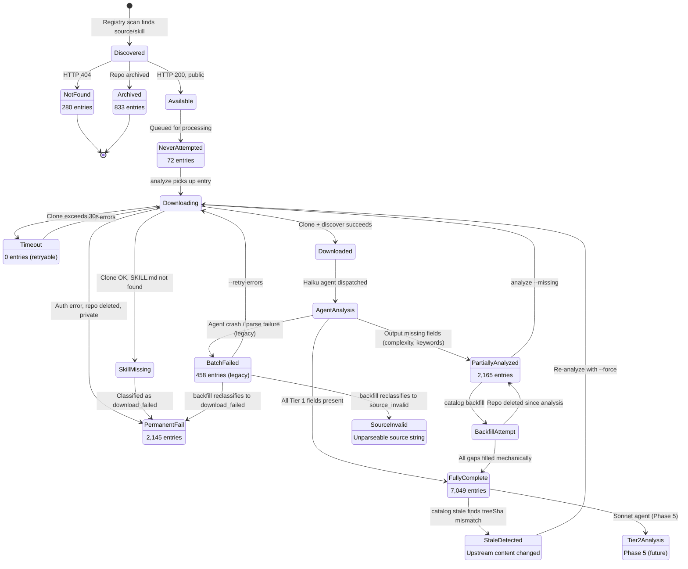

# Skill Catalog Entry State Machine

## States Summary

| State | Count | % | Terminal? |
|-------|-------|---|-----------|
| Not Found | 280 | 2.2% | Yes |
| Archived | 833 | 6.4% | Yes |
| Never Attempted | 72 | 0.6% | No |
| Batch Failed (unclassified) | 458 | 3.5% | No (reclassifiable) |
| Permanent Download Failure | 2,145 | 16.5% | Yes (unless repo restored) |
| Partially Analyzed | 2,165 | 16.7% | No (backfillable / re-analyzable) |
| Fully Complete | 7,049 | 54.2% | No (progresses to Tier 2) |

## State Machine

## Transition Table

| From | To | Trigger | Notes |
|------|----|---------|-------|
| Discovered | NotFound | Availability check returns 404 | Terminal |
| Discovered | Archived | Repo flagged as archived | Terminal |
| Discovered | Available | HTTP 200, public repo | Enters processing pipeline |
| Available | NeverAttempted | Initial state after availability check | Waiting for analyze run |
| NeverAttempted | Downloading | `catalog analyze` picks up entry | Normal flow |
| BatchFailed | Downloading | `--retry-errors` flag | Retries legacy failures |
| Timeout | Downloading | `--retry-errors` flag | Retries timeouts |
| Downloading | PermanentFail | Clone fails (auth, deleted, private) | `download_failed`, not retryable |
| Downloading | SkillMissing | Clone OK but SKILL.md not found | Skill name mismatch |
| Downloading | Timeout | Clone exceeds 30s | `download_timeout`, retryable |
| Downloading | Downloaded | Clone + discover succeeds | Ready for agent |
| SkillMissing | PermanentFail | Classified as `download_failed` | Immediate transition |
| Downloaded | AgentAnalysis | Haiku agent dispatched in worktree | Judgment analysis |
| AgentAnalysis | FullyComplete | All fields in NDJSON output | Best outcome |
| AgentAnalysis | PartiallyAnalyzed | Missing complexity/keywords in output | Agent output incomplete |
| AgentAnalysis | BatchFailed | Agent crash or NDJSON parse failure | Legacy error type |
| PartiallyAnalyzed | BackfillAttempt | `catalog backfill` command | Mechanical, no agent |
| PartiallyAnalyzed | Downloading | `analyze --missing <field>` | Full re-analysis |
| BackfillAttempt | FullyComplete | All gaps filled mechanically | headingTree, treeSha, keywords |
| BackfillAttempt | PartiallyAnalyzed | Repo deleted since original analysis | Can't fill remaining gaps |
| BatchFailed | PermanentFail | `catalog backfill` reclassifies | Structured error type |
| BatchFailed | SourceInvalid | `catalog backfill` reclassifies | Source string unparseable |
| FullyComplete | StaleDetected | `catalog stale` finds treeSha mismatch | Upstream changed |
| StaleDetected | Downloading | Re-analyze with `--force` | Fresh analysis |
| FullyComplete | Tier2Analysis | Phase 5 (future) | Sonnet-level quality scoring |

## Why Entries Get Stuck

### Partially Analyzed (2,165)

Entries were analyzed successfully in an earlier run, but the repo has since been deleted/made private. The backfill command can't re-download to fill missing fields. These entries have `wordCount` (from the original analysis) but are missing `treeSha` (not computed in old runs), `headingTree` (not computed in old runs), or `complexity` (agent didn't output it).

### Permanent Download Failure (2,145)

Repos that consistently fail to clone: deleted, made private, renamed, or require auth that isn't available. These have `lastErrorType: download_failed` and `retryable: false`.

### Batch Failed (458)

Legacy errors from runs before the structured error classification existed. These have `lastErrorType: batch_failed` — the generic fallback. The `catalog backfill` command reclassifies some of these, but 458 remain because the backfill also failed (can't determine the specific error type if the repo is gone).

### Never Attempted (72)

Entries that were never picked up by any analyze run. Likely added to the catalog after the last full run, or fell through a gap in batch scheduling.
